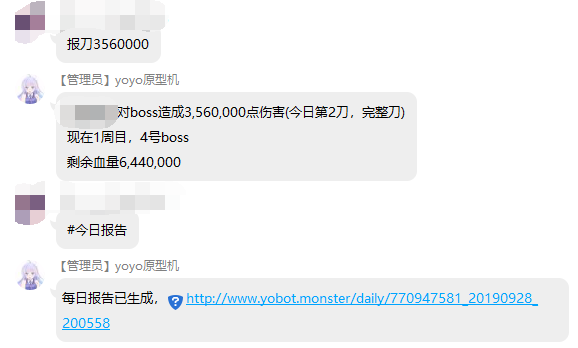
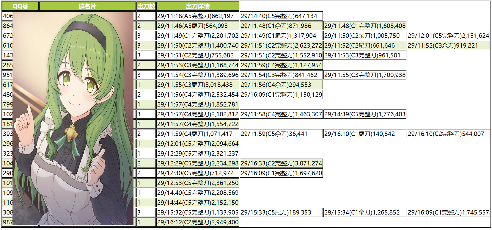
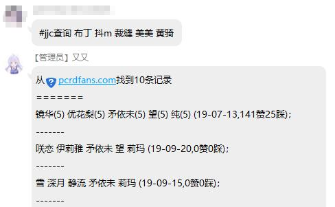
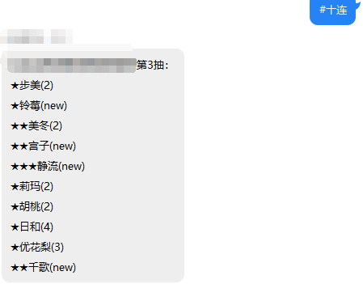

# yobot 公主连接群聊机器人

## 介绍

yobot 是为[公主连接](https://game.bilibili.com/pcr/)玩家打造的群聊机器人，开源、免费。

## 试用

（试用功能崩溃中。。）

## 安装

[安装教程](/install/)

## 使用

请参照[指令表](/features.md)。

## 功能介绍

### 公会战伤害统计助手

公会战成员可以把每一次伤害报告给机器人，
以生成统计数据

只要机器人记录下 boss 的状态和每一次出刀伤害，就可以：

- 统计每一天的出刀情况，生成报表
- 统计当月公会战的出刀情况与得分，
重新计算成员的公会战贡献
（不同于 CY 的伤害乘系数，
本公式计算每个 boss 的伤害与平均伤害的比例，
尾刀与完整到的比例，
更合理地计算成员的贡献）
- 预约 boss，当对应 boss 出现时提醒预约的人
- 挂树，当前 boss 被击败时提醒挂树的人
- 申请出刀，提醒之后申请出刀的人有人正在出刀，防止意外撞刀

### 竞技场查询助手

通过机器人快速查询竞技场阵容的解法

（数据由[公主连结Re: Dive Fan Club](https://pcrdfans.com/)提供）

### 新闻推送

机器人主动发送游戏新闻与活动提醒

### 模拟抽卡

模拟十连抽，
而且可以记录每个人的仓库并在线查看，
还可以自定义修改卡池
（怕打扰可以关闭此功能）

### 更多功能

更多功能请参照[指令表](/features/)。

## 源码

<https://gitee.com/yobot/yobot>
